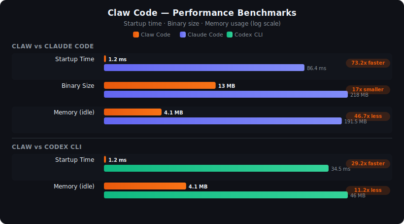

<div align="center">

# claw-bench

**Runtime overhead benchmarks for AI coding CLIs — Rust vs Node.js**

[](LICENSE)
[](https://github.com/devswha/claw-bench/actions/workflows/benchmark.yml)
[](bench-all.sh)

<br/>



<br/>

> Measured on Ubuntu 24.04 · [Run your own benchmarks](#quick-start) · Inspired by [claw-code](https://github.com/devswha/claw-code)

</div>

---

Minimal benchmark suite comparing **Claw Code** (Rust single-binary CLI) vs **Claude Code** (Node.js CLI), with **optional Codex runtime comparison** for the stable local-only benchmarks.

## Stable Default Suite

`./bench-all.sh` intentionally runs only the **stable local runtime core**:
- startup time
- install footprint
- idle memory

Everything else in this repo is **manual / experimental** and should be treated as exploratory rather than headline-quality benchmarking.

Default stable-suite behavior remains **human-readable terminal output**. If you want machine-readable artifacts, the three stable benchmark scripts support an optional `--json` mode that writes one JSON file under `results/tier0/`, and `./bench-all.sh --json` writes a timestamped Tier 0 directory containing one per-benchmark JSON file plus `manifest.json`. The three per-benchmark Tier 0 JSON files share one envelope: `schema_version`, `suite`, `tier`, `benchmark`, `script`, `run_id`, `generated_at`, `environment`, `tools`, and `results`; `manifest.json` is the companion index for the suite run.

## Sample Results

Measured on Ubuntu 24.04 (Linux 6.8), same machine, same API endpoint.

| Benchmark | Claw (Rust) | Claude (Node.js) | Ratio |
|-----------|-------------|-------------------|-------|
| Startup time | **1.2 ms** | 86.4 ms | 73.2x faster |
| Binary size | **13 MB** | 218 MB | 17x smaller |
| Memory (idle) | **4.1 MB** | 191.5 MB | 46.7x less |

> Results vary by machine, network, and API provider. Run your own benchmarks.

### Optional Codex Runtime Comparison

If `CODEX_BIN` is configured and `codex` is already authenticated locally, the stable core scripts (`startup`, `size`, `memory`) will include **Codex CLI** automatically.

Codex is currently treated as a **runtime-only comparison target** in this repo:
- included automatically in the lightweight runtime benchmarks
- **not** yet wired into the long-running task-effectiveness harnesses
- uses its own local Codex auth/session, not `ANTHROPIC_API_KEY`

| Benchmark | Claw (Rust) | Codex CLI | Ratio |
|-----------|-------------|-----------|-------|
| Startup time | **1.2 ms** | 34.5 ms | 29.2x faster |
| Memory (idle) | **4.1 MB** | 46.0 MB | 11.2x less |

## Experimental Scripts

These scripts are still in the repo, but are **not** part of the default suite because they are much more environment-sensitive:

- `experimental/bench-ttft.sh`
- `experimental/bench-session.sh`
- `experimental/bench-syscall.sh`
- `experimental/bench-cpu.sh`
- `experimental/bench-io.sh`
- `experimental/bench-threads.sh`
- `experimental/bench-gc.sh`
- `experimental/bench-practical.sh`
- `experimental/bench-swebench.sh`
- `experimental/bench-terminal.sh`
- `experimental/bench-polyglot.sh`

Use them manually only if you are comfortable with:
- API/provider variability
- timeout-capped measurements
- Docker / Python harness setup
- Claw-first task harnesses rather than symmetric tool-vs-tool evaluation
- manual/early Tier 1 practical-task previews rather than a full task suite

## Benchmarks

| Script | Measures | Tool |
|--------|----------|------|
| `bench-startup.sh` | Cold start time | [hyperfine](https://github.com/sharkdp/hyperfine) |
| `bench-memory.sh` | Idle RSS memory | `/usr/bin/time -v` |
| `bench-size.sh` | Binary and install size | `du` |
| `bench-all.sh` | Stable runtime suite | — |
| `experimental/bench-ttft.sh` | Time to first response | `date +%s%N` |
| `experimental/bench-session.sh` | Memory over long session | `ps` polling |
| `experimental/bench-syscall.sh` | Syscall count and breakdown | `strace -c` |
| `experimental/bench-cpu.sh` | CPU cycles, IPC, cache misses | `perf stat` |
| `experimental/bench-io.sh` | File open/read/write counts | `strace -e trace=` |
| `experimental/bench-threads.sh` | Thread/process footprint | `/proc/pid/task` |
| `experimental/bench-gc.sh` | Page faults, RSS growth | `perf stat` + `/proc` |
| `experimental/bench-practical.sh` | Tier 1 practical coding task preview | temp workspace + verifier |
| `experimental/bench-swebench.sh` | SWE-bench Verified score | Docker + Python |
| `experimental/bench-terminal.sh` | Terminal-Bench 2.0 score | Docker + Harbor |
| `experimental/bench-polyglot.sh` | Aider Polyglot score | Python + git |

## Prerequisites

```bash
# Stable default suite
sudo apt install hyperfine bc

# Experimental profiling scripts
sudo apt install strace linux-tools-common linux-tools-$(uname -r)

# perf may require relaxing paranoid mode:
echo 0 | sudo tee /proc/sys/kernel/perf_event_paranoid
```

### Experimental task-harness prerequisites

```bash
# Docker (required for SWE-bench and Terminal-Bench)
# See: https://docs.docker.com/get-docker/

# Python 3.10+ with venv
sudo apt install python3-venv

# Harnesses are auto-installed on first run
# Disk space: ~50GB for SWE-bench, ~20GB for Terminal-Bench
```

## Quick Start

```bash
git clone https://github.com/devswha/claw-bench.git
cd claw-bench

# Configure paths and API key
cp env.example.sh env.sh
vi env.sh

# Run the stable suite
./bench-all.sh

# Or run individual stable scripts
./bench-startup.sh
./bench-size.sh
./bench-memory.sh

# Optional: persist one machine-readable Tier 0 result file
./bench-startup.sh --json

# Optional: persist machine-readable Tier 0 results for the full stable suite
./bench-all.sh --json

# Manual / experimental: run the Tier 1 practical bootstrap slice
./experimental/bench-practical.sh --json
```

## Configuration

Edit `env.sh` (never committed — gitignored):

```bash
CLAW_BIN="$HOME/workspace/claw-code/rust/target/release/claw"
CLAUDE_BIN="$(which claude)"
CODEX_BIN="$(which codex)"
API_KEY="your-anthropic-api-key"
```

An **Anthropic API key** is only needed for the experimental API-path / task harness scripts. Get one at [console.anthropic.com](https://console.anthropic.com/).

Codex does **not** use `ANTHROPIC_API_KEY` in this repo; it relies on your existing `codex login` session.

## Security

- `env.sh` is gitignored and never committed
- API keys are exported in subshells only — automatically cleaned up on exit
- Binary paths are validated before execution
- Stable runtime benchmarks stay terminal-only by default, but `--json` writes timestamped Tier 0 artifacts under `results/tier0/`
- `bench-all.sh --json` emits `startup-time.json`, `install-size.json`, `idle-memory.json`, and `manifest.json`
- Tier 1 practical-task previews are manual/experimental and write JSON under `results/tier1/`
- Task-effectiveness harnesses clone repos, create virtualenvs, and write timestamped results under `swebench/results/`, `terminal-bench/results/`, and `polyglot/results/`

## License

MIT
